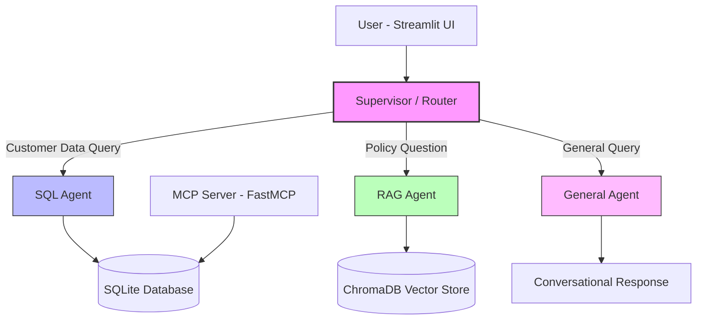

# Generative AI Multi-Agent Customer Support System

[](https://github.com/RickyT715/Generative-AI-Multi-Agent-System/actions/workflows/ci.yml)


An intelligent multi-agent customer support system powered by LangGraph, featuring natural language querying of customer data (Text-to-SQL), company policy documents (RAG), and a conversational general assistant — all orchestrated by a supervisor router agent.

## Architecture



**Flow:**
1. User sends a message via the Streamlit chat interface
2. The **Supervisor** classifies the query using structured output (Pydantic model) into: `sql_agent`, `rag_agent`, or `general`
3. The query is routed to the appropriate **specialist agent**
4. The agent uses its tools (SQL toolkit, vector retriever, or conversational) to generate a response
5. The response is returned to the user with relevant context

## Features

- **Multi-Agent Architecture**: Supervisor-based routing with specialized agents for different query types
- **Text-to-SQL**: Natural language queries translated to SQL against customer/ticket/product data
- **RAG (Retrieval-Augmented Generation)**: Policy document search with citation-backed answers
- **MCP Integration**: FastMCP server exposing customer support tools via Model Context Protocol
- **Multi-Provider LLM Support**: Switch between Anthropic Claude, OpenAI GPT-4o, or Google Gemini with one config change
- **PDF Upload**: Runtime document ingestion via the Streamlit sidebar
- **Conversation Memory**: Thread-based conversation persistence via LangGraph checkpointer
- **Fully Self-Contained**: Synthetic data generation — no external data downloads needed

## Quick Start

### Option 1: Local Setup

```bash
# 1. Clone the repository
git clone https://github.com/RickyT715/Generative-AI-Multi-Agent-System.git
cd Generative-AI-Multi-Agent-System

# 2. Create virtual environment
python -m venv .venv
source .venv/bin/activate  # On Windows: .venv\Scripts\activate

# 3. Install dependencies
pip install -r requirements.txt

# 4. Configure environment
cp .env.example .env
# Edit .env with your API key (ANTHROPIC_API_KEY, OPENAI_API_KEY, or GOOGLE_API_KEY)

# 5. Generate data and index documents
python scripts/setup.py

# 6. Run the application
streamlit run app.py
```

### Option 2: Docker

```bash
# 1. Configure environment
cp .env.example .env
# Edit .env with your API key

# 2. Run with Docker Compose
docker compose up --build

# App available at http://localhost:8501
# ChromaDB at http://localhost:8000
```

## Configuration

All configuration is done via the `.env` file:

| Variable | Description | Default |
|----------|-------------|---------|
| `LLM_PROVIDER` | LLM provider (`anthropic`, `openai`, `google`) | `anthropic` |
| `LLM_MODEL` | Model name | `claude-sonnet-4-5-20250929` |
| `LLM_TEMPERATURE` | Response temperature | `0.0` |
| `ANTHROPIC_API_KEY` | Anthropic API key | — |
| `OPENAI_API_KEY` | OpenAI API key | — |
| `GOOGLE_API_KEY` | Google API key | — |
| `SQLITE_DB_PATH` | SQLite database path | `data/customer_support.db` |
| `CHROMA_PERSIST_DIR` | ChromaDB persistence directory | `data/chroma` |
| `CHROMA_COLLECTION_NAME` | ChromaDB collection name | `policy_documents` |
| `EMBEDDING_MODEL` | HuggingFace embedding model | `sentence-transformers/all-MiniLM-L6-v2` |

## Example Interactions

| Query | Routed To | Description |
|-------|-----------|-------------|
| "What is the refund policy?" | RAG Agent | Retrieves from policy PDFs |
| "Show me John Doe's ticket history" | SQL Agent | Queries SQLite database |
| "How many open tickets are there?" | SQL Agent | Aggregate SQL query |
| "What are the privacy data retention periods?" | RAG Agent | Policy document lookup |
| "Hello, what can you help me with?" | General Agent | Conversational response |
| "List all premium customers" | SQL Agent | Database query with filter |

## Project Structure

```
Generative-AI-Multi-Agent-System/
├── src/
│   ├── agents/              # Specialist agents (SQL, RAG, General)
│   │   ├── supervisor.py    # Query router with structured output
│   │   ├── sql_agent.py     # Text-to-SQL agent
│   │   ├── rag_agent.py     # Document retrieval agent
│   │   └── general_agent.py # Conversational fallback
│   ├── tools/               # Agent tools
│   │   ├── sql_tools.py     # SQLDatabaseToolkit wrapper
│   │   ├── retrieval_tools.py # Vector search tool
│   │   └── mcp_tools.py     # MCP client integration
│   ├── config/
│   │   └── settings.py      # LLM factory, env config
│   ├── db/
│   │   ├── vector_store.py  # ChromaDB operations
│   │   └── sql_database.py  # SQLite connection
│   ├── mcp_servers/
│   │   └── support_server.py # FastMCP server
│   ├── prompts/             # System prompts for each agent
│   ├── state/
│   │   └── schemas.py       # CustomerSupportState
│   └── graph.py             # Main graph assembly
├── tests/                   # Unit tests
├── data/
│   ├── seed/                # Data generation scripts
│   └── documents/           # Policy PDFs (generated)
├── scripts/
│   └── setup.py             # One-command setup
├── app.py                   # Streamlit UI
├── Dockerfile
├── docker-compose.yml
└── langgraph.json           # LangGraph Studio config
```

## Testing

```bash
# Install dev dependencies
pip install -r requirements-dev.txt

# Run all tests
pytest tests/ -v

# Run with coverage
pytest tests/ -v --cov=src --cov-report=term-missing

# Run only unit tests (no external services)
pytest tests/ -m "not integration" -v

# Lint
ruff check .
ruff format --check .
```

## Tech Stack

| Component | Technology |
|-----------|-----------|
| Agent Framework | LangGraph 1.0.9 + LangChain 1.2.10 |
| LLM (default) | Anthropic Claude Sonnet 4.5 |
| LLM (alternatives) | OpenAI GPT-4o, Google Gemini |
| Vector Database | ChromaDB 1.5.1 |
| SQL Database | SQLite |
| Embeddings | HuggingFace (all-MiniLM-L6-v2) |
| MCP Server | FastMCP (mcp 1.26.0) |
| UI | Streamlit 1.54 |
| PDF Processing | PyMuPDF |

## Demo Video

> [Demo video URL placeholder — to be added]

## License

MIT
