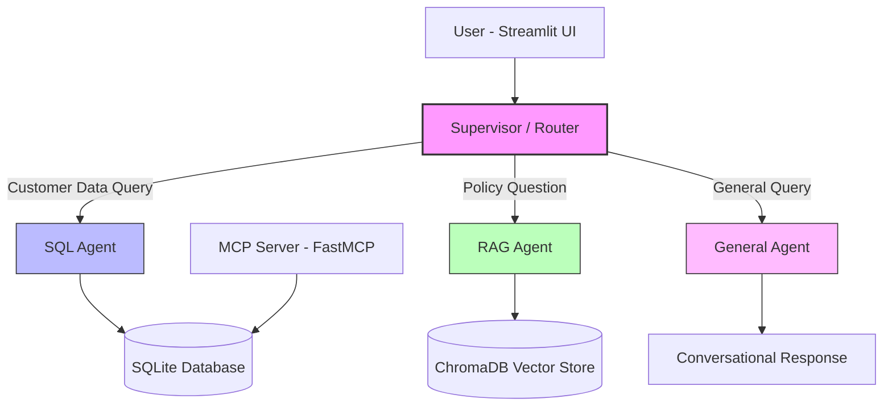

# Generative AI Multi-Agent Customer Support System

[](https://github.com/RickyT715/Generative-AI-Multi-Agent-System/actions/workflows/ci.yml)


An intelligent multi-agent customer support system powered by LangGraph, featuring natural language querying of customer data (Text-to-SQL), company policy documents (RAG), and a conversational general assistant — all orchestrated by a supervisor router agent.

## Demo Video

[](https://youtu.be/EcxOXfc0TR0)

## Architecture



**Flow:**
1. User sends a message via the Streamlit chat interface
2. The **Supervisor** classifies the query using structured output (Pydantic model) into: `sql_agent`, `rag_agent`, or `general`
3. The query is routed to the appropriate **specialist agent**
4. The agent uses its tools (SQL toolkit, vector retriever, or conversational) to generate a response
5. The response is returned to the user with relevant context

## Features

- **Multi-Agent Architecture**: Supervisor-based routing with specialized agents for different query types
- **Text-to-SQL**: Natural language queries translated to SQL against customer/ticket/product data
- **RAG (Retrieval-Augmented Generation)**: Policy document search with citation-backed answers
- **MCP Integration**: FastMCP server exposing customer support tools via Model Context Protocol
- **Multi-Provider LLM Support**: Switch between Anthropic Claude, OpenAI GPT-4o, or Google Gemini — configurable from the sidebar with curated model dropdowns and custom model input
- **Persistent Settings**: Provider, model, temperature, and API keys saved to `.env` from the UI — survives page reloads
- **File Upload Pipeline**: Upload CSV, PDF, or TXT files via the sidebar — CSVs are auto-detected and inserted into the SQL database; PDF/TXT files are indexed into the vector store
- **Conversation Memory**: Thread-based conversation persistence via LangGraph checkpointer
- **Fully Self-Contained**: Synthetic data generation — no external data downloads needed

## Quick Start

### Option 1: Local Setup

```bash
# 1. Clone the repository
git clone https://github.com/RickyT715/Generative-AI-Multi-Agent-System.git
cd Generative-AI-Multi-Agent-System

# 2. Create virtual environment
python -m venv .venv
source .venv/bin/activate  # On Windows: .venv\Scripts\activate

# 3. Install dependencies
pip install -r requirements.txt

# 4. Configure environment
cp .env.example .env
# Edit .env with your API key (ANTHROPIC_API_KEY, OPENAI_API_KEY, or GOOGLE_API_KEY)

# 5. Generate data and index documents
python scripts/setup.py

# 6. Run the application
streamlit run app.py
```

### Option 2: Docker

```bash
# 1. Configure environment
cp .env.example .env
# Edit .env with your API key

# 2. Run with Docker Compose
docker compose up --build

# App available at http://localhost:8501
# ChromaDB at http://localhost:8000
```

## Configuration

Settings can be changed from the **Streamlit sidebar** (Configuration panel) and persisted by clicking **Save Settings**. This writes values back to the `.env` file, so they survive page reloads. You can also edit `.env` directly:

| Variable | Description | Default |
|----------|-------------|---------|
| `LLM_PROVIDER` | LLM provider (`anthropic`, `openai`, `google`) | `anthropic` |
| `LLM_MODEL` | Model name | `claude-sonnet-4-5-20250929` |
| `LLM_TEMPERATURE` | Response temperature | `0.0` |
| `ANTHROPIC_API_KEY` | Anthropic API key | — |
| `OPENAI_API_KEY` | OpenAI API key | — |
| `GOOGLE_API_KEY` | Google API key | — |
| `SQLITE_DB_PATH` | SQLite database path | `data/customer_support.db` |
| `CHROMA_PERSIST_DIR` | ChromaDB persistence directory | `data/chroma` |
| `CHROMA_COLLECTION_NAME` | ChromaDB collection name | `policy_documents` |
| `EMBEDDING_MODEL` | HuggingFace embedding model | `sentence-transformers/all-MiniLM-L6-v2` |

## Uploading Data & Documents

You can upload your own data through the **Document Management** panel in the Streamlit sidebar. All uploaded data is **persisted to disk** — you only need to upload once and it survives app restarts.

### Supported File Types

| File Type | Routed To | What Happens | Stored In |
|-----------|-----------|--------------|-----------|
| **CSV** | SQL Database | Auto-detects table (`customers`, `products`, or `tickets`) by matching column headers, validates rows, then inserts into SQLite | `data/customer_support.db` |
| **PDF** | Vector Store | Extracts text, splits into chunks (512 chars), generates embeddings, indexes into ChromaDB | `data/chroma/` |
| **TXT** | Vector Store | Same as PDF — splits into chunks and indexes into ChromaDB | `data/chroma/` |

### How to Upload

1. Open the app (`streamlit run app.py`)
2. In the left sidebar, find **Document Management**
3. Click **Browse files** (or drag and drop) — you can select multiple files at once
4. Click **Process Uploaded Files**
5. Each file shows a progress status (detecting type → validating → inserting/indexing → done)

### CSV Column Requirements

CSVs are auto-detected into the correct table based on column headers. Required columns:

| Target Table | Required Columns | Optional Columns |
|-------------|-----------------|-----------------|
| `customers` | `name`, `email` | `phone`, `account_type`, `subscription_tier`, `join_date`, `address`, `account_status` |
| `products` | `name`, `category`, `price` | `description` |
| `tickets` | `customer_id`, `subject`, `description` | `category`, `priority`, `status`, `channel`, `assigned_agent`, `created_at`, `resolved_at`, `resolution`, `satisfaction_rating` |

- Primary key IDs (`customer_id`, `product_id`, `ticket_id`) are auto-assigned — do not include them in the CSV
- Column names are case-insensitive
- Extra columns not in the schema are ignored

### Data Persistence

All data is stored locally under the `data/` directory:

```
data/
├── customer_support.db    # SQLite — all customer, product, and ticket records
├── chroma/                # ChromaDB — all document embeddings (PDF + TXT)
└── documents/             # Source PDFs generated during initial setup
```

- **SQLite** (`data/customer_support.db`): New CSV rows are appended to existing tables. The database file persists across restarts.
- **ChromaDB** (`data/chroma/`): New PDF/TXT documents are chunked, embedded, and added to the existing collection. The vector index persists across restarts.
- **Resetting data**: To start fresh, stop the app and run `python scripts/setup.py` — this regenerates the synthetic data and re-indexes the default policy documents. Alternatively, delete the `data/` directory and re-run setup.

### Test Files

Sample files for testing uploads are provided in `test_uploads/`:

| File | Type | Contents |
|------|------|----------|
| `new_customers.csv` | CSV → customers | 5 new customer records |
| `new_products.csv` | CSV → products | 5 new product records |
| `new_tickets.csv` | CSV → tickets | 5 new support tickets |
| `employee_handbook.txt` | TXT → vector store | ~3,900-word employee handbook (15 sections) |
| `it_security_policy.pdf` | PDF → vector store | 12-page IT security policy (10 chapters + appendices) |

After uploading the test documents, try queries like:
- *"What is TechCorp's VPN policy?"* — retrieves from IT security policy
- *"How many PTO days do employees with 5 years of tenure get?"* — retrieves from employee handbook
- *"Show me all products in the ai category"* — queries newly added products from CSV

## Example Interactions

| Query | Routed To | Description |
|-------|-----------|-------------|
| "What is the refund policy?" | RAG Agent | Retrieves from policy PDFs |
| "Show me John Doe's ticket history" | SQL Agent | Queries SQLite database |
| "How many open tickets are there?" | SQL Agent | Aggregate SQL query |
| "What are the privacy data retention periods?" | RAG Agent | Policy document lookup |
| "Hello, what can you help me with?" | General Agent | Conversational response |
| "List all premium customers" | SQL Agent | Database query with filter |

## Project Structure

```
Generative-AI-Multi-Agent-System/
├── src/
│   ├── agents/              # Specialist agents (SQL, RAG, General)
│   │   ├── supervisor.py    # Query router with structured output
│   │   ├── sql_agent.py     # Text-to-SQL agent
│   │   ├── rag_agent.py     # Document retrieval agent
│   │   └── general_agent.py # Conversational fallback
│   ├── tools/               # Agent tools
│   │   ├── sql_tools.py     # SQLDatabaseToolkit wrapper
│   │   ├── retrieval_tools.py # Vector search tool
│   │   └── mcp_tools.py     # MCP client integration
│   ├── processing/
│   │   └── file_processor.py # CSV/PDF/TXT upload & ingestion pipeline
│   ├── config/
│   │   └── settings.py      # LLM factory, env config
│   ├── db/
│   │   ├── vector_store.py  # ChromaDB operations
│   │   └── sql_database.py  # SQLite connection
│   ├── mcp_servers/
│   │   └── support_server.py # FastMCP server
│   ├── prompts/             # System prompts for each agent
│   ├── state/
│   │   └── schemas.py       # CustomerSupportState
│   └── graph.py             # Main graph assembly
├── tests/                   # Unit tests
├── test_uploads/            # Sample files for testing the upload pipeline
├── data/
│   ├── customer_support.db  # SQLite database (persisted across restarts)
│   ├── chroma/              # ChromaDB vector index (persisted across restarts)
│   ├── seed/                # Data generation scripts
│   └── documents/           # Policy PDFs (generated by setup)
├── scripts/
│   └── setup.py             # One-command setup
├── app.py                   # Streamlit UI
├── Dockerfile
├── docker-compose.yml
└── langgraph.json           # LangGraph Studio config
```

## Testing

```bash
# Install dev dependencies
pip install -r requirements-dev.txt

# Run all tests
pytest tests/ -v

# Run with coverage
pytest tests/ -v --cov=src --cov-report=term-missing

# Run only unit tests (no external services)
pytest tests/ -m "not integration" -v

# Lint
ruff check .
ruff format --check .
```

## RAG Pipeline Evaluation (RAGAS)

The project includes [RAGAS](https://docs.ragas.io/) evaluation to measure retrieval and answer quality with concrete metrics. The test dataset contains 15 questions (5 per policy PDF) with ground truth answers derived from the actual document content.

### Running the Evaluation

```bash
# Retrieval quality only (no LLM generation, cheaper)
python tests/test_ragas_evaluation.py --mode retrieval

# Answer quality only
python tests/test_ragas_evaluation.py --mode answer

# Full evaluation (both)
python -m pytest tests/test_ragas_evaluation.py -v -m integration -s
```

### Evaluation Results

The RAG pipeline uses **semantic chunking** (SemanticChunker, percentile breakpoint=90), **hybrid search** (BM25 + dense via EnsembleRetriever, weights 0.4/0.6), and **cross-encoder reranking** (ms-marco-MiniLM-L-6-v2, top_n=5).

**Retrieval Quality** — did the retriever fetch the right chunks?

| Metric | Baseline | Enhanced | Change |
|--------|----------|----------|--------|
| Context Recall | 0.77 | **1.00** | +0.23 |
| Context Precision | 0.60 | **0.84** | +0.24 |

**Answer Quality** — did the LLM produce correct answers?

| Metric | Baseline | Enhanced | Change |
|--------|----------|----------|--------|
| Faithfulness | 0.97 | **0.95** | -0.02 |
| Factual Correctness | 0.49 | **0.60** | +0.11 |
| Answer Relevancy | 0.82 | **0.97** | +0.15 |
| Semantic Similarity | 0.82 | **0.84** | +0.02 |

> Baseline = fixed-size chunking (512 chars) + dense-only search (k=5). Enhanced = semantic chunking + hybrid BM25/dense + cross-encoder reranking.

> These tests are marked `@pytest.mark.integration` and `@pytest.mark.slow`, so they are skipped in CI. They require a populated ChromaDB vector store and LLM API keys.

## Tech Stack

| Component | Technology |
|-----------|-----------|
| Agent Framework | LangGraph 1.0.9 + LangChain 1.2.10 |
| LLM (default) | Anthropic Claude Sonnet 4.5 |
| LLM (alternatives) | OpenAI GPT-4o, Google Gemini |
| Vector Database | ChromaDB 1.5.1 |
| SQL Database | SQLite |
| Embeddings | HuggingFace (all-MiniLM-L6-v2) |
| Reranker | cross-encoder/ms-marco-MiniLM-L-6-v2 |
| MCP Server | FastMCP (mcp 1.26.0) |
| UI | Streamlit 1.54 |
| PDF Processing | PyMuPDF |

## License

MIT
